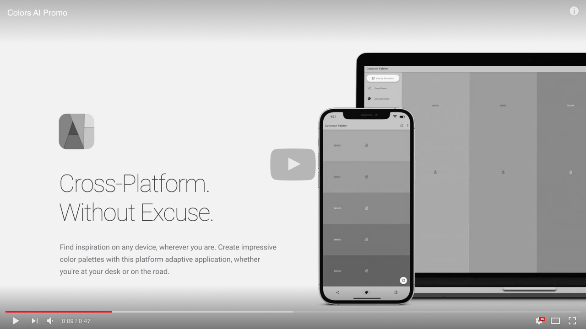
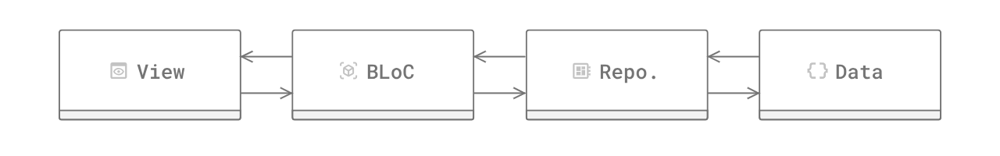

[](https://codecov.io/gh/tsinis/colors_ai)
[](https://www.codefactor.io/repository/github/tsinis/colors_ai)
[](https://github.com/tsinis/colors_ai/actions/workflows/test.yaml)
[](https://play.google.com/store/apps/details?id=is.tsin.colors_ai.colors_ai)
[](https://snapcraft.io/colors-ai)
[](https://github.com/tsinis/colors_ai/releases)
[](https://github.com/tsinis/colors_ai/stars)
[](https://opensource.org/licenses/MIT)

[](https://vimeo.com/tsinis/colors-ai)

[](https://play.google.com/store/apps/details?id=is.tsin.colors_ai.colors_ai)
[](https://snapcraft.io/colors-ai)
[](https://apps.microsoft.com/store/detail/colors-ai/9NJVF29FV74V)

Or download signed binaries for **all mainstream platforms** in the [Releases](https://github.com/tsinis/colors_ai/releases) section of this repository.

# Colors AI 🎨🤖

## Table of content

* [Description](#description)
* [Technical Data](#technical-data)
  * [Architecture](#architecture)
  * [Directory Structure](#directory-structure)
  * [Tests](#tests)
* [Accessibility](#accessibility)
* [How to run it](#how-to-run-it)
* [Design](#design)
* [To-Do Section](#to-do-section)
* [Licenses](#licenses)
* [Attributions](#attributions)

## Description

Colors AI is a cross-platform color scheme generator that uses **deep learning from public API providers**. Application is made with *Flutter&trade; SDK* and available for all mainstream operating systems, mobile included.

Features:

* Choose from open APIs, with the ability to set up custom settings
* Export section with many export formats to save or clipboard copy
* URL providers to other static color generators
* Localized to several languages
* Dark and light theme
* Material Design 3
* Data encryption
* Accessibility
* And much more

## Technical Data

### Architecture


App is made with a reactive style **BLoC pattern**, in four-layered architecture. User **events are passed to Blocs**, which are **processing inputs to repositories and waiting** (async mostly, since we are fetching, parsing data from REST API) **for their response from the data layer**. After that **Blocs mapping the states according to repository response**. Data layers are not linked to Flutter itself, they are abstracted from the framework and using pure Dart dependencies only. Also, no dependency injectors are used in this app either.

### Directory Structure

The application uses a **feature-driven** directory structure. This project structure allows to scale the project by having self-contained features.

### Tests

More than 93% (∼98% actually, due to [mixin coverage bug in Dart language](https://github.com/dart-lang/sdk/issues/49887) since Dart 2.19) of the application is [covered by hundreds of tests](https://app.codecov.io/gh/tsinis/colors_ai), you can find here: [Unit (mainly), Widget](../test/) and [Integration tests](../integration_test/).

## Accessibility

The app was originally designed to be accessible by **WCAG 2.1 AA standards at minimum, and AAA in particular**, although it was not intended to be used by the blind or by people with severe visual disabilities. All **texts have a contrast ratio at least of 4.5, images 3.0, touch target sizes of at least 48dp**. The application was audited physically on a first-generation iPhone SE (smallest iPhone at this moment) with maximum font size, thickness, contrast, and component magnification. The **audit was also performed on the macOS** version of the app, using the same Accessibility Inspector as on the iOS. The **report from the official Accessibility Scanner for Android** (with a tested device with screen size 640x320px and maximum UI and font scale) can be found at [resources/accessibility](../resources/accessibility/) folder. As you may see it will only complain about the small tap size of text links in the *About* app section and overall screen semantics (which is a [framework bug](https://github.com/flutter/flutter/issues/39531)). Also, the application is **translated into 4 languages, have a haptic feedback (vibration) on mobile devices and sound feedback on all platforms**. The UI was also built to be **controllable via keyboard/input device/remote control/gamepad**.

## How to run it

Flutter **3.6** or higher is assumed to be installed. For your convenience, all generated code has been committed to this repository, so all you have to do is run this command from the terminal/command line from the project's root folder:

```shell
flutter run
```

### How to generate localization files

This project follows the [official internationalization guide for Flutter](https://docs.flutter.dev/development/accessibility-and-localization/internationalization). To update localizations, simple add/change texts in ARB files and run:

```shell
flutter gen-l10n --output-localization-file=app_localizations.g.dart --no-synthetic-package
```

### Platform Specific Setup

You should run all platforms (except Linux) versions of the app without any additional steps.

* For Linux builds you will need to install those packages first (via sudo apt-get install): `clang, cmake, unzip, curl, ninja-build, pkg-config, libgtk-3-dev, liblzma-dev, libgstreamer1.0-dev, libgles2-mesa-dev, libgstreamer-plugins-base1.0-dev, libsecret-1-dev, libjsoncpp-dev`. If you want to run app from this binary, you will also need `libsecret-1-0`. Please do not use a Snap version of Flutter, since it have a locked CMake version at this moment. So basically you can just run:

```shell
sudo apt-get update -y
sudo apt-get --assume-yes --fix-missing install libgles2-mesa-dev clang cmake unzip curl ninja-build pkg-config libgtk-3-dev liblzma-dev libgstreamer1.0-dev libgstreamer-plugins-base1.0-dev libsecret-1-dev libjsoncpp-dev libsecret-1-0
```

## Design

All animations here are made with pure Flutter. The application's UI is designed with "gesture-first" UX on mobile platforms and strictly following [Material Design 3 (Material You) Guidelines](https://m3.material.io). Neutral grey color UI is used here to not disrupt user's color perception with highly contrasting light or dark themes.

## To-Do Section

* [ ] Refactor.
* [ ] Use Freezed for more Events/States.
* [ ] Use new Enums from Dart 2.17+.
* [x] Separate data layer more.
* [x] Create more interfaces for Data and Repository layers.
* [x] Add exports to PDF and PNG.
* [x] L10N.

> You can also find a few more specific TODOs in source code files.

## Licenses

This project is released under the terms of the [MIT license](../LICENSE). All assets (as sounds, fonts) licensed and are free for personal use. You can find **LICENSE** files in their folders.

## Attributions

The following is a list of sound assets used in this application and their proper attribution.

["Material Product Sounds"](https://material.io/design/sound/sound-resources.html) by [Google](https://about.google) is licensed under [CC BY 4.0](https://creativecommons.org/licenses/by/4.0/legalcode)

Assets Used (converted from original WAV to MP3):

* notification_high-intensity.mp3
* notification_simple-02.mp3
* ui_lock.mp3
* ui_refresh-feed.mp3

> Flutter and the related logo are trademarks of Google LLC. We are not endorsed by or affiliated with Google LLC.
