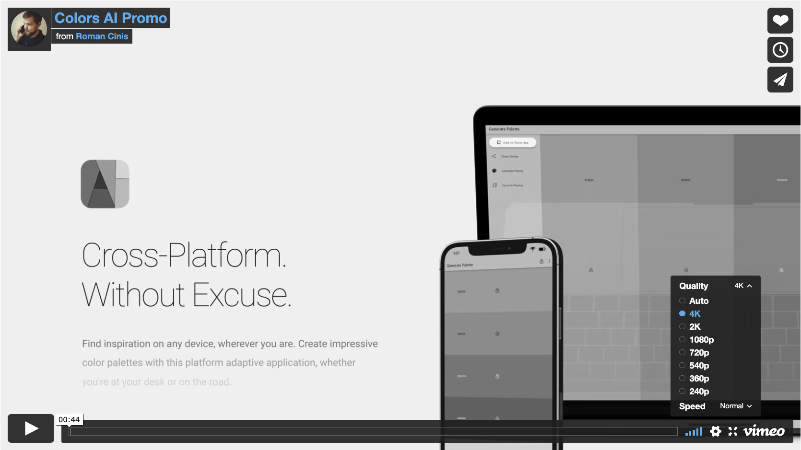

[](https://play.google.com/store/apps/details?id=is.tsin.colors_ai.colors_ai)
[](https://snapcraft.io/colors-ai)
[](https://github.com/tsinis/colors_ai/releases)
[](https://opensource.org/licenses/MIT)

[](https://vimeo.com/tsinis/colors-ai)

[](https://play.google.com/store/apps/details?id=is.tsin.colors_ai.colors_ai)
[](https://snapcraft.io/colors-ai)
[](https://www.microsoft.com/store/apps/9NJVF29FV74V)

Or download signed binaries for **all mainstream platforms** in the [Releases](https://github.com/tsinis/colors_ai/releases) section of this repository.

# Colors AI 🎨🤖

## Table of content

* [Description](#Description)
* [Technical Data](#Technical-Data)
  * [Architecture](#Architecture)
  * [Directory Structure](#Directory-Structure)
  * [Tests](#Tests)
* [Accessibility](#Accessibility)
* [How to run it](#How-to-run-it)
* [Design](#Design)
* [To-Do Section](#To-Do-Section)
* [Licenses](#Licenses)
* [Attributions](#Attributions)

## Description

Colors AI is a cross-platform color scheme generator that uses **deep learning from from public API providers**. Application is made with *Flutter&trade; SDK* and available for all mainstream operating systems, mobile included.

## Technical Data

### Architecture


App is made with a reactive style **BLoC pattern**, in four-layered architecture. User **events are passed to Blocs**, which are **processing inputs to repositories and waiting** (async mostly, since we are fetching, parsing data from REST API) **for their response from the data layer**. After that **Blocs mapping the states according to repository response**. Data layers are not linked to Flutter itself, they are abstracted from the framework and using pure Dart dependencies only. Also, no dependency injectors are used in this app either.

### Directory Structure

The application uses a **feature-driven** directory structure. This project structure allows to scale the project by having self-contained features.

### Tests

Application is **partially covered with Unit, Widget, and Integration tests**. More to come in the future.

## Accessibility

The app was originally designed to be accessible by **WCAG 2.1 AA standards at minimum, and AAA in particular**, although it was not intended to be used by the blind or by people with severe visual disabilities. All **texts have a contrast ratio at least of 4.5, images 3.0, touch target sizes of at least 48dp**. The application was audited physically on a first-generation iPhone SE (smallest iPhone at this moment) with maximum font size, thickness, contrast, and component magnification. The **audit was also performed on the macOS** version of the app, using the same Accessibility Inspector as on the iOS. The **report from the official Accessibility Scanner for Android** (with a tested device with screen size 640x320px and maximum UI and font scale) can be found at [resources/accessibility](./resources/accessibility/) folder. As you may see it will only complain about the small tap size of text links in the *About* app section and overall screen semantics (which is a [framework bug](https://github.com/flutter/flutter/issues/39531)). Also, the application is **translated into 4 languages, have a haptic feedback (vibration) on mobile devices and sound feedback on all platforms**. The UI was also built to be **controllable via keyboard/input device/remote control/gamepad**, however, in the future, I'm planning to improve the control via the input devices.

## How to run it

Flutter version **2.8** or higher is assumed to be installed. Please run this command from the project's folder, in your terminal:

```bash
flutter pub get
flutter gen-l10n
flutter run
```

### Platform Specific Setup

You should run the mobile and Windows versions of the app without any additional steps.

* For macOS builds you may need to install [CMake](https://cmake.org/download) first and add your macOS device to your developer's account (not necessary for direct XCode builds).
* For Linux builds you will need to install those packages first (via sudo apt-get install): `libvlc-dev, vlc, libsecret-1-dev, libjsoncpp-dev`. If you want to run app from this binary, you will also need `libsecret-1-0` and `libjsoncpp1`. Please do not use a Snap version of Flutter, since it have a locked CMake version at this moment.

## Design

All animations here are made with pure Flutter. The application's UI is designed with "gesture-first" UX on mobile platforms and strictly following [Material Design 3 (Material You) Guidelines](https://m3.material.io). Neutral grey color UI is used here to not disrupt user's color perception with highly contrasting light or dark themes.

## To-Do Section

* [ ] Refactor.
* [ ] Write more tests.
* [x] Separate data layer more.
* [x] Create more interfaces for Data and Repository layers.
* [x] Add exports to PDF and PNG.
* [x] L10N.
* [ ] Add more keyboard shortcuts.
* [ ] Add Feedback.
* [ ] Provide support for Favorites export/backup.

> You can also find a few more specific TODOs in source code files.

## Licenses

This project is released under the terms of the [MIT license](./LICENSE). All assets (as sounds, fonts) licensed and are free for personal use. You can find **LICENSE** files in their folders.

## Attributions

The following is a list of sound assets used in this application and their proper attribution.

["Material Product Sounds"](https://material.io/design/sound/sound-resources.html) by [Google](https://about.google) is licensed under [CC BY 4.0](https://creativecommons.org/licenses/by/4.0/legalcode)

Assets Used:

* notification_high-intensity.wav
* notification_simple-02.wav
* ui_lock.wav
* ui_refresh-feed.wav

> Flutter and the related logo are trademarks of Google LLC. We are not endorsed by or affiliated with Google LLC.
